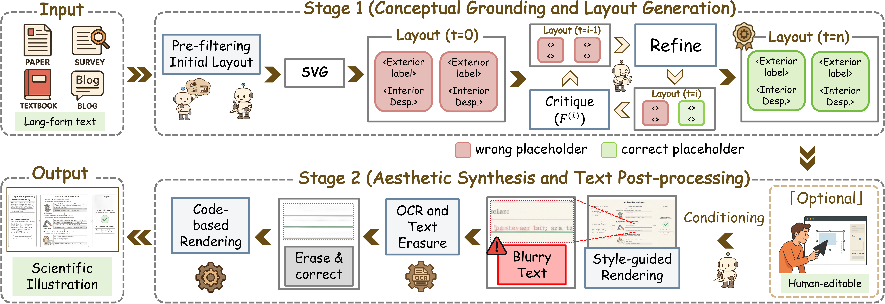
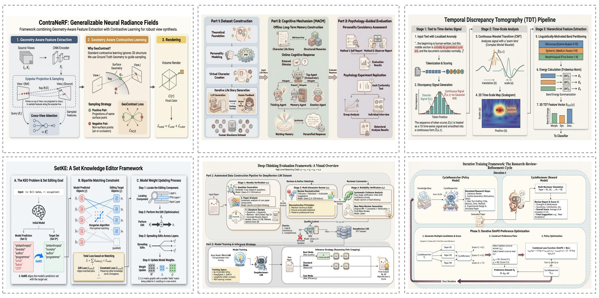
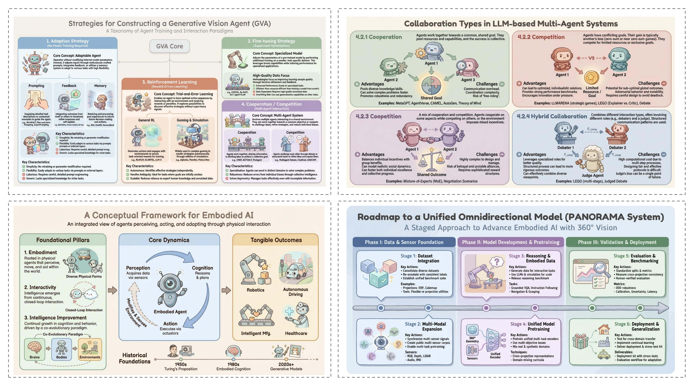
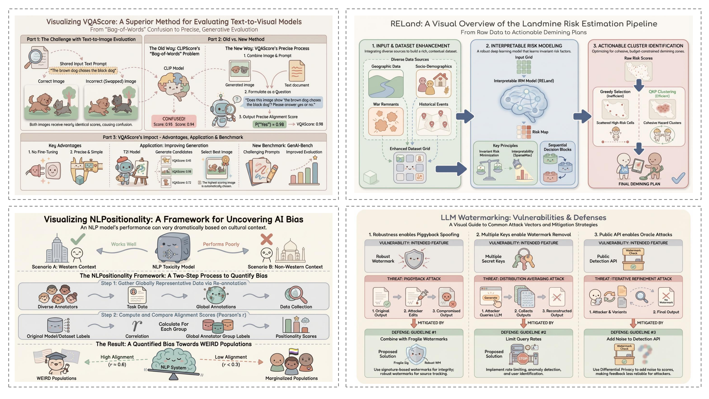
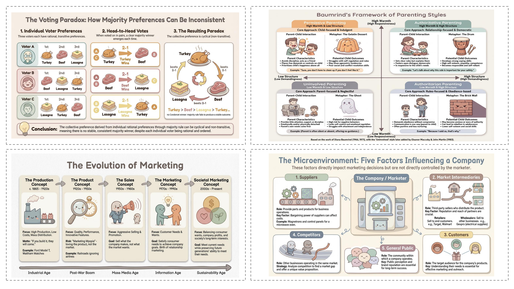
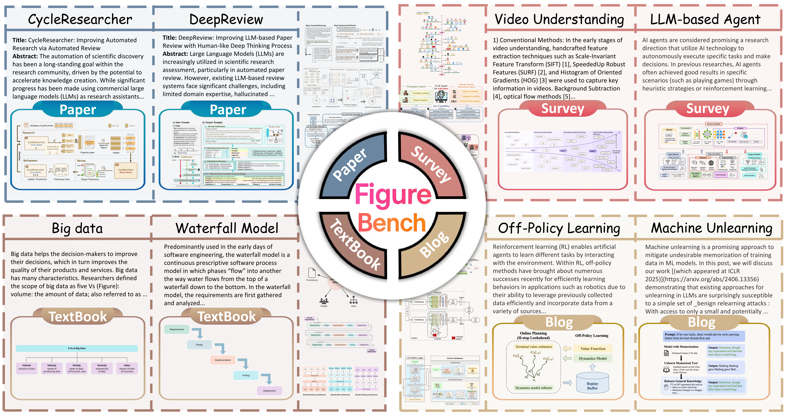

<div align="center">


# AutoFigure：生成并优化可直接发表的科学插图 [ICLR 2026]

> [!注]
> 本项目基于 [AutoFigure](https://github.com/ResearAI/AutoFigure)，旨在与任意模型提供商实现无缝集成。它抽象化了提供商特有的复杂性，使您无需修改应用程序代码，即可轻松在 OpenRouter、Google AI、Bianxie 或任何兼容 OpenAI 的 API 之间切换。

---

[](https://openreview.net/forum?id=5N3z9JQJKq)
[](https://opensource.org/licenses/MIT)
[](https://www.python.org/)
[](https://huggingface.co/datasets/WestlakeNLP/FigureBench)
[](https://deepscientist.cc/)

<p align="center">
  <strong>从文本到可发表的图表</strong><br>
  AutoFigure 是一个智能系统，它利用大型语言模型（LLMs）并结合迭代优化，能够根据文本描述或研究论文生成高质量的科学图表。
</p>

[快速入门](#-quick-start) • [Web 界面](#-web-interface) • [配置](#%EF%B8%8F-configuration) • [API 参考](#-api-reference)

</div>

---

https://github.com/user-attachments/assets/d0c954a9-9cf3-4c8b-8b04-71d75a68854c

## 🔥 最新动态

- **[2026.03.24]** 🧠 我们的姊妹项目 **DeepScientist v1.5** 现已正式发布。这是一个以本地优先为理念的开源自主研究系统，旨在实现端到端的科学发现。欢迎前往 [GitHub](https://github.com/ResearAI/DeepScientist) 探索，或阅读 [ICLR 2026 论文](https://openreview.net/forum?id=cZFgsLq8Gs)。
- **[2026.03.11]** 📄 我们的 **AutoFigure-Edit** 论文现已发布在 [arXiv](https://arxiv.org/pdf/2603.06674)，并入选了 🤗[Hugging Face Daily Papers](https://huggingface.co/papers/2603.06674)！如果您觉得我们的工作有帮助，请考虑在 Hugging Face 上为我们**点赞**，并**引用**我们的论文。谢谢！❤️
- **[2026.02.17]** 🚀 **AutoFigure-Edit 在线平台**现已上线！所有学者均可免费使用。欢迎访问 [deepscientist.cc](https://deepscientist.cc) 体验，或查看我们在 [GitHub](https://github.com/ResearAI/AutoFigure-Edit) 上的开源代码。这个全新的 Edit 版本性能大幅提升！
- **[2026.01.26]** 🎉 AutoFigure 已被 **ICLR 2026** 录用！您可在 [arXiv](https://arxiv.org/abs/2602.03828) 上阅读论文。

---

## ✨ 功能

| 功能            | 描述                                                       |
| :-------------- | :--------------------------------------------------------- |
| 📝 **文本转图** | 直接根据自然语言描述生成图表。                             |
| 📄 **论文转图** | 从 PDF 中提取方法论并自动生成可视化图表。                  |
| 🔄 **迭代优化** | 采用双代理系统（生成 + 评估）实现持续的质量优化。          |
| 🎨 **多种格式** | 输出为 **SVG** 或 **mxGraph XML**（与 draw.io 完全兼容）。 |
| 💅 **图像增强** | 可选的 AI 驱动后处理，实现美化效果。                       |
| 🖥️ **网页界面** | 交互式 Next.js 前端，便于生成和编辑。                      |

---

## 🚀 工作原理

AutoFigure 采用 **审查-精炼** 循环机制，以确保高精度与美学品质。


</div>

> **流程：**
>
> 1. **生成：** 智能体根据描述和参考资料创建初始 SVG/XML。
> 2. **评估：** 评审员对质量进行评分（0-10 分）并提供具体反馈。
> 3. **优化：** 循环持续进行，直至图表达到出版标准。

---

## 🌟 生成示例

以下是 AutoFigure 在不同领域生成的图表示例，展示了其在处理不同复杂度场景时的多功能性。

|                                     类别与可视化                                      |
| :-----------------------------------------------------------------------------------: |
|    **📄 论文案例**<br>     |
|    **📊 调查案例**<br>    |
|     **📝 博客案例**<br>     |
| **📘 教科书案例**<br> |

---

## ⚡ 快速入门

### 方案 1：Python SDK（推荐）

您可以通过克隆仓库进行安装：

```bash
git clone https://github.com/ResearAI/AutoFigure.git
cd AutoFigure
pip install -e .
playwright install chromium  # 渲染所需
```

#### 1. 基本用法（文本转图像）

```python
from autofigure import AutoFigureAgent, Config

# 1. 配置
config = Config(
    generation_api_key="your-api-key",
    generation_provider="openrouter",  # 选项：‘openrouter’、'gemini'、‘bianxie’
    generation_model="google/gemini-3.1-pro-preview",
)

# 2. 生成
agent = AutoFigureAgent(config)
result = agent.generate(
    description="展示 Transformer 训练流程的流程图",
    max_iterations=5,
    output_format="svg",
    topic="paper" # ‘paper’, ‘survey’, ‘blog’, ‘textbook’
)

print(f“✅ 已生成：{result.svg_path} (得分：{result.final_score}/10)”)
```

#### 2. 基于论文生成（PDF/Markdown）

从论文中提取方法论并自动生成图表。

```python
# 根据论文（PDF 或 Markdown）生成图表
result = agent.generate_from_paper(
    paper_path="./paper.pdf",
    max_iterations=5,
    output_format="svg",
    enable_enhancement=True, # 增强结果
)

if result.success:
    print(f“提取的方法学内容：{result.methodology_text[:200]}...”)
    print(f“生成的图表：{result.svg_path}”)
```

#### 3. 带图像增强

生成该图表的多个经过美化增强的变体。

```python
result = agent.generate(
    description="神经网络架构图",
    enable_enhancement=True,
    enhancement_count=3,     # 生成 3 个变体
    art_style="线条简洁的现代科学插画",
    enhancement_input_type="code2prompt" # 最佳质量模式
)

if result.success:
    print(f“原始预览：{result.preview_path}”)
    print(f“增强变体：{result.enhanced_paths}”)
```

### 方案 2：Web 界面

非常适合可视化交互和编辑。

```bash
./start.sh
# 然后在浏览器中打开 http://localhost:6002
```

---

## 📊 FigureBench 数据集

我们推出 **FigureBench**，这是首个用于从长文本生成科学插图的大规模基准测试。

<div align="center">

</div>

### 数据集概述

| 类别          |  样本数   | 平均词数 | 文本密度  |     复杂度      |
| :------------ | :-------: | :------: | :-------: | :-------------: |
| 📄 **论文**   |   3,200   |  12,732  |   42.1%   |       高        |
| 📝 **博客**   |    20     |  4,047   |   46.0%   |       中        |
| 📊 **综述**   |    40     |  2,179   |   43.8%   |       高        |
| 📘 **教科书** |    40     |   352    |   25.0%   |       低        |
| **总计**      | **3,300** | **10k+** | **41.2%** | **~5.3 个组件** |

### 下载

  <a href="https://huggingface.co/datasets/WestlakeNLP/FigureBench">
    
  </a>
</div>

```python
from datasets import load_dataset
dataset = load_dataset(“WestlakeNLP/FigureBench”)
```

---

## ⚙️ 配置

AutoFigure 具有高度可配置性。您可以在 `Config()` 中设置这些选项，或通过环境变量进行配置。

### 支持的 LLM 提供商

| 提供商         | 基础 URL                | 推荐文本/SVG 模型               | 推荐图像模型                            |
| -------------- | ----------------------- | ------------------------------- | --------------------------------------- |
| **OpenRouter** | `openrouter.ai/api/v1`  | `google/gemini-3.1-pro-preview` | `google/gemini-3.1-flash-image-preview` |
| **Bianxie**    | `api.bianxie.ai/v1`     | `gemini-3.1-pro-preview`        | `gemini-3.1-flash-image-preview`        |
| **Google**     | `generativelanguage...` | `gemini-3.1-pro-preview`        | `gemini-3.1-flash-image-preview`        |

### 生成设置

| 选项                  | 描述                                      | 默认值       |
| --------------------- | ----------------------------------------- | ------------ |
| `generation_api_key`  | 图像生成 API 密钥                         | 必填         |
| `generation_base_url` | API 基础 URL                              | 提供商默认值 |
| `generation_model`    | 模型名称                                  | 提供商默认值 |
| `generation_provider` | 提供商：‘openrouter’、'bianxie'、‘gemini’ | ‘openrouter’ |

### 方法论提取设置

| 选项                   | 描述                | 默认值         |
| ---------------------- | ------------------- | -------------- |
| `methodology_api_key`  | 方法论提取 API 密钥 | 与生成设置相同 |
| `methodology_model`    | 方法论提取模型      | 与生成设置相同 |
| `methodology_provider` | 方法论提取提供商    | 与生成设置相同 |

### 增强设置

| 选项                     | 描述                                    | 默认值        |
| ------------------------ | --------------------------------------- | ------------- |
| `enhancement_api_key`    | 图像增强的 API 密钥                     | 无            |
| `enhancement_provider`   | 增强提供商                              | ‘openrouter’  |
| `enhancement_model`      | 图像增强的模型                          | 提供商默认值  |
| `enhancement_input_type` | 输入类型：‘none’、'code'、‘code2prompt’ | ‘code2prompt’ |
| `enhancement_count`      | 要生成的增强变体数量                    | 1             |
| `art_style`              | 增强所需的艺术风格描述                  | ‘’            |

### 管道设置

| 选项                | 描述             | 默认值                |
| ------------------- | ---------------- | --------------------- |
| `max_iterations`    | 最大精炼迭代次数 | 5                     |
| `quality_threshold` | 质量阈值 (0-10)  | 9.0                   |
| `output_dir`        | 输出目录         | ‘./autofigure_output’ |
| `custom_references` | 自定义参考图路径 | 无                    |

---

## 📚 API 参考

### `generate()` 参数

| 参数                     | 描述                                            |
| ------------------------ | ----------------------------------------------- |
| `description`            | 要生成的图形的文本描述                          |
| `max_iterations`         | 最大迭代次数（覆盖配置）                        |
| `output_format`          | ‘svg’ 或 ‘mxgraphxml’                           |
| `quality_threshold`      | 质量阈值（覆盖配置）                            |
| `enable_enhancement`     | 是否对最终图像进行增强                          |
| `art_style`              | 增强所用的艺术风格（覆盖配置）                  |
| `enhancement_input_type` | ‘none’、'code' 或 ‘code2prompt’（覆盖配置）     |
| `enhancement_count`      | 增强变体数量（覆盖配置）                        |
| `topic`                  | 内容类型：‘paper’、'survey'、‘blog’、'textbook' |
| `custom_references`      | 自定义参考文献图路径                            |

### `generate_from_paper()` 参数

接受 `generate()` 中的所有参数，此外还包括：

| 参数                   | 描述                            |
| ---------------------- | ------------------------------- |
| `paper_path`           | 论文文件路径（PDF 或 Markdown） |
| `methodology_api_key`  | 提取 API 密钥（覆盖配置）       |
| `methodology_provider` | 提取提供商（覆盖配置）          |

### 结果对象 (`GenerationResult`)

| 属性               | 描述                        |
| ------------------ | --------------------------- |
| `success`          | 生成是否成功                |
| `svg_path`         | 生成的 SVG 文件路径         |
| `mxgraph_path`     | 生成的 mxGraph XML 文件路径 |
| `preview_path`     | PNG 预览图像路径            |
| `enhanced_paths`   | 所有增强图像路径列表        |
| `final_score`      | 最终质量评分（0-10）        |
| `methodology_text` | 提取的方法论（来自论文）    |
| `error`            | 失败时的错误信息            |

### 增强模式

| 模式          | 描述                                                  |
| ------------- | ----------------------------------------------------- |
| `none`        | 不参考代码直接美化                                    |
| `code`        | 使用生成的代码（SVG/XML）作为参考                     |
| `code2prompt` | 使用大语言模型（LLM）分析代码并生成详细提示词（推荐） |

---

## 📁 项目结构

<details>
<summary>点击展开目录树</summary>

```
AutoFigure/
├── autofigure/              # 📦 Python SDK
│   ├── agent.py             # 主代理
│   ├── generator.py         # 生成管道
│   ├── enhancer.py          # 图像增强
│   └── extractor.py         # PDF 方法提取
├── frontend/                # 🖥️ Next.js Web UI
├── backend/                 # 🔌 Flask API 服务器
├── scripts/                 # 🛠️ 实用脚本
└── pyproject.toml           # 配置文件
```

</details>

---

## 🤝 社区与支持

**微信讨论群**  
扫描二维码加入我们的社区。如果二维码已过期，请添加微信ID `nauhcutnil` 或联系 `tuchuan@mail.hfut.edu.cn`。

<table>
  <tr>
    <td></td>
  </tr>
</table>
---

## 📜 引用与许可

如果您在研究中使用了 **AutoFigure**、**AutoFigure-Edit** 或 **FigureBench**，请引用：

```bibtex
@inproceedings{
zhu2026autofigure,
title={AutoFigure: 生成与优化可直接发表的科学插图},
author={朱敏军, 林振, 翁一轩, 卢潘中, 谢秋杰, 魏一凡, 刘思凡, 孙启瑶, 张悦},
booktitle={第十四届学习表征国际会议},
year={2026},
url={https://openreview.net/forum?id=5N3z9JQJKq}
}

@misc{lin2026autofigureeditgeneratingeditablescientific,
      title={AutoFigure-Edit: 生成可编辑的科学插图},
      作者={林振、谢秋杰、朱敏军、李世臣、孙琪瑶、顾恩浩、丁一然、孙可、郭方、卢潘中、宁志远、翁一轩、张悦},
      年份={2026},
      eprint={2603.06674},
      archivePrefix={arXiv},
      primaryClass={cs.CV},
      url={https://arxiv.org/abs/2603.06674},
}
```

仓库元数据及使用指南：

- [CITATION.cff](./CITATION.cff)
- [引用与署名指南](./CITATION_AND_ATTRIBUTION.md)
- [名称与徽标使用规范](./TRADEMARK.md)

本项目采用 MIT 许可证授权——详情请参阅 `LICENSE`。
名称和徽标的使用规则在 `TRADEMARK.md` 中另行说明。

---

## ResearAI 的更多内容

探索 ResearAI 提供的更多开源研究工具：

| 项目                                                                     | 功能                 |
| ------------------------------------------------------------------------ | -------------------- |
| [DeepScientist](https://github.com/ResearAI/DeepScientist)               | 自主科学发现系统     |
| [AutoFigure-Edit](https://github.com/ResearAI/AutoFigure-Edit)           | 可编辑的矢量论文图   |
| [DeepReviewer-v2](https://github.com/ResearAI/DeepReviewer-v2)           | 论文与草稿评审       |
| [Awesome-AI-Scientist](https://github.com/ResearAI/Awesome-AI-Scientist) | 精选 AI 科学家生态图 |

---

本项目的最佳配置是使用 Google AI Studio [[https://aistudio.google.com/](https://aistudio.google.com/)] 中的 `gemini-3.1-flash-image-preview` 作为图像生成模型，并使用 `gemini-3.1-pro-preview` 作为文本模型。每次运行成本约为 0.50 美元，消耗约 30,000 个令牌，耗时约 20 分钟。

[中国大陆地区提示] Gemini 的服务条款不允许中国大陆地区的用户访问或使用该服务。如果 OpenRouter 报错，通常是因为在中国大陆注册的账户缺乏使用Gemini所需的权限。建议使用在美国或欧洲注册的OpenRouter账户，并确保符合相关规定。
